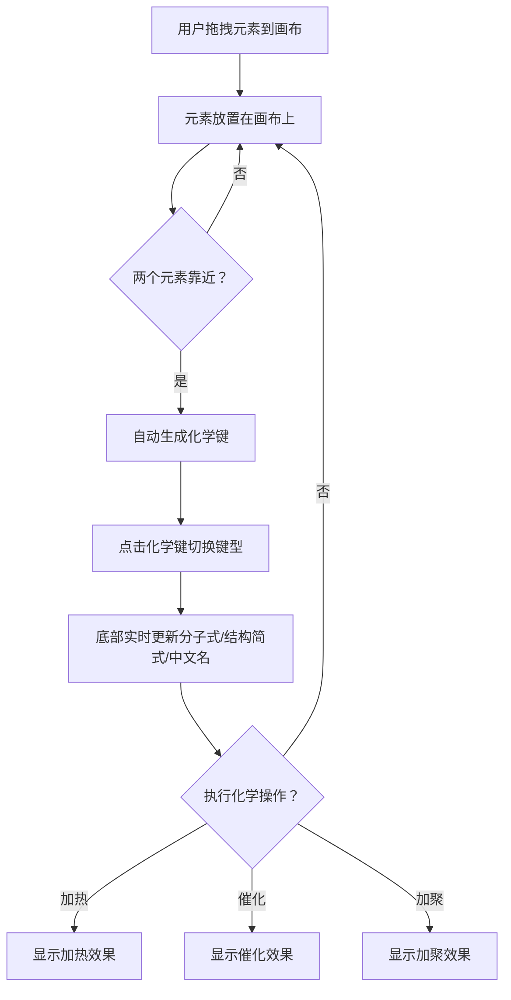

# Sy Organic Chemistry - 产品需求文档

## 1. 产品概述
Sy Organic Chemistry 是一个交互式有机化学分子构建与展示工具，面向化学学生和教师，提供直观的分子骨架模型搭建体验。
- 核心目标：让用户通过拖拽元素和官能团快速构建有机分子骨架模型，实时查看分子式、结构简式和中文名称
- 目标用户：高中及大学化学学习者、化学教师

## 2. 核心功能

### 2.1 功能模块
1. **分子画布页**：骨架模型展示、元素拖拽、化学键编辑、分子信息展示、化学操作

### 2.2 页面详情

| 页面名称 | 模块名称 | 功能描述 |
|---------|---------|---------|
| 分子画布页 | 骨架模型画布 | 左侧大区域展示分子骨架模型，支持拖动画布平移和缩放调整视角 |
| 分子画布页 | 元素面板 | 右侧可折叠/展开的元素列表，包含全部118个元素和常见官能团，支持拖拽到画布 |
| 分子画布页 | 化学键系统 | 两个元素放在一起自动补全化学键，点击化学键可切换单键/双键/三键 |
| 分子画布页 | 分子信息栏 | 屏幕底部左侧显示分子式、结构简式、中文名称 |
| 分子画布页 | 化学操作栏 | 屏幕底部右侧显示加热、催化、加聚等化学操作按钮 |
| 分子画布页 | 元素图例 | 显示各元素对应颜色的图例说明 |

## 3. 核心流程

用户从右侧元素面板拖拽元素到左侧画布 → 元素自动放置 → 将两个元素靠近时自动生成化学键 → 点击化学键切换键类型 → 底部实时更新分子信息 → 可执行化学操作

## 4. 用户界面设计

### 4.1 设计风格
- **主色调**：黑色背景（#0a0a0a），搭配荧光绿（#00ff88）作为主强调色，科技感十足
- **辅助色**：深灰（#1a1a2e）用于面板背景，中灰（#2a2a3e）用于卡片和边框
- **元素颜色**：CPK 配色方案（化学标准配色），每种元素独立颜色
- **按钮风格**：圆角胶囊按钮，带发光效果和 hover 动画
- **字体**：显示字体使用 Orbitron（科技感），正文字体使用 Noto Sans SC（中文支持）
- **布局风格**：左右分栏布局，左侧大画布 + 右侧元素面板，底部信息栏
- **动画**：元素拖拽时的发光轨迹、化学键生成动画、操作按钮的脉冲效果

### 4.2 页面设计概览

| 页面名称 | 模块名称 | UI 元素 |
|---------|---------|---------|
| 分子画布页 | 骨架模型画布 | 深色画布背景，网格辅助线，元素球体模型，化学键连线，支持平移缩放 |
| 分子画布页 | 元素面板 | 右侧抽屉式面板，元素按周期表分组，官能团单独分组，每个元素/官能团显示符号和颜色 |
| 分子画布页 | 分子信息栏 | 底部左侧半透明面板，显示分子式（下标格式）、结构简式、中文名称 |
| 分子画布页 | 化学操作栏 | 底部右侧胶囊按钮组，加热（火焰图标）、催化（闪电图标）、加聚（链接图标）等 |
| 分子画布页 | 元素图例 | 右侧面板底部或独立浮动面板，显示元素符号与颜色对应关系 |

### 4.3 响应式设计
- **桌面端**：左右分栏，画布占 70%，元素面板占 30%
- **平板端**：元素面板变为可收起的侧边抽屉，画布全屏，点击按钮展开面板
- **手机端**：元素面板变为底部抽屉，画布占满屏幕，信息栏和操作栏堆叠显示

### 4.4 3D 场景指引
- **环境**：深色空间，微弱网格地面，营造实验室氛围
- **光照**：环境光 + 点光源，元素球体带微弱自发光
- **相机**：正交投影，支持鼠标/触摸拖拽旋转和缩放
- **交互**：拖拽元素到画布、点击化学键切换类型、拖动画布旋转视角
