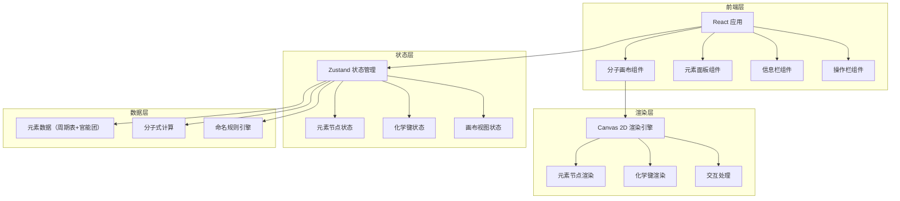

# Sy Organic Chemistry - 技术架构文档

## 1. 架构设计



## 2. 技术说明
- **前端框架**：React 18 + TypeScript + Vite
- **样式方案**：Tailwind CSS 3
- **状态管理**：Zustand
- **渲染引擎**：Canvas 2D（用于分子骨架模型的绘制和交互）
- **初始化工具**：vite-init
- **后端**：无（纯前端应用）
- **数据库**：无（所有数据内置在前端）

## 3. 路由定义

| 路由 | 用途 |
|------|------|
| / | 主页面，包含分子画布、元素面板、信息栏和操作栏 |

## 4. 核心数据结构

### 4.1 元素数据
```typescript
interface ElementData {
  symbol: string;       // 元素符号，如 "C", "H", "O"
  name: string;         // 中文名称
  atomicNumber: number; // 原子序数
  color: string;        // CPK 配色
  maxBonds: number;     // 最大成键数
  category: string;     // 分类：非金属/金属/惰性气体等
}

interface FunctionalGroup {
  name: string;         // 官能团名称，如 "羟基"
  formula: string;      // 化学式，如 "-OH"
  shorthand: string;    // 简写，如 "OH"
  color: string;        // 显示颜色
  atoms: AtomNode[];    // 组成原子
}
```

### 4.2 画布节点与化学键
```typescript
interface AtomNode {
  id: string;
  element: ElementData;
  x: number;
  y: number;
  bonds: Bond[];
}

interface Bond {
  id: string;
  from: string;        // 起始原子 ID
  to: string;          // 目标原子 ID
  type: 1 | 2 | 3;    // 单键/双键/三键
}

interface CanvasState {
  nodes: AtomNode[];
  bonds: Bond[];
  offsetX: number;
  offsetY: number;
  scale: number;
}
```

## 5. 关键技术实现

### 5.1 Canvas 2D 渲染
- 使用 HTML5 Canvas 2D API 绘制分子骨架模型
- 元素以圆形节点表示，颜色遵循 CPK 配色方案
- 化学键以线段表示，单键/双键/三键分别用 1/2/3 条线表示
- 支持画布平移（拖拽空白区域）和缩放（滚轮/双指缩放）

### 5.2 拖拽交互
- 从元素面板拖拽元素到画布：使用 HTML5 Drag and Drop API
- 画布内元素拖拽：Canvas 事件监听 + 命中检测
- 自动成键：当两个元素距离小于阈值时自动创建化学键

### 5.3 化学键编辑
- 点击化学键：命中检测判断点击位置是否在键上
- 切换键类型：1→2→3→1 循环切换
- 视觉反馈：点击时高亮，切换时有动画效果

### 5.4 分子式计算
- 遍历所有节点统计元素数量
- 按化学惯例排序（C → H → 其他按字母序）
- 生成下标格式的分子式

### 5.5 响应式适配
- 使用 CSS Grid + Tailwind 断点实现响应式布局
- 平板端（md 断点）：元素面板变为侧边抽屉
- 手机端（sm 断点）：元素面板变为底部抽屉，操作栏和信息栏堆叠
